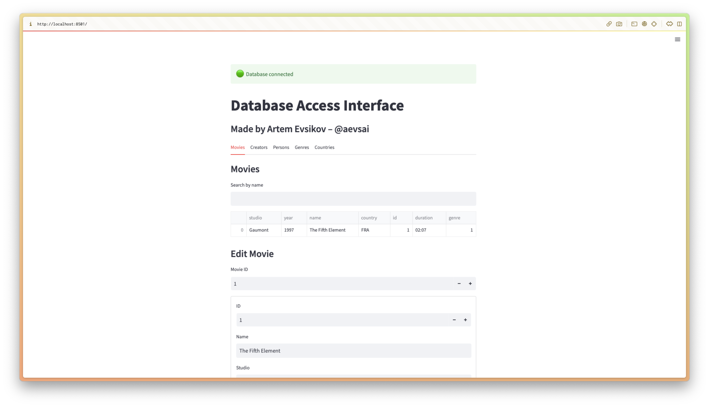

# Practice work for Database classes at HSE

# Models
Folder `/app/data/models` contains database models:
- persons - short info about persons
- movies - short info about movies
- creators - relation of person and movies with job title and role for actors
- countries – iso alpha-3
- genres

# Data Access Layer
Folder `/app/data/access` contains data access objects for each model that provide all CRUD functions.
SqlAlchemy 2.0 used for access to database. Config data stored at `app/database.py`

# UI and Business Logic Layer
UI created with Streamlit integrated with business logic

